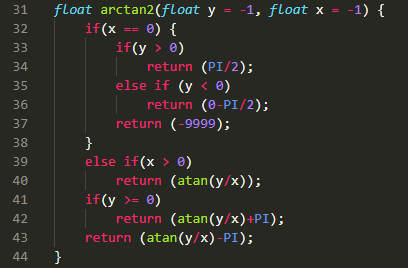
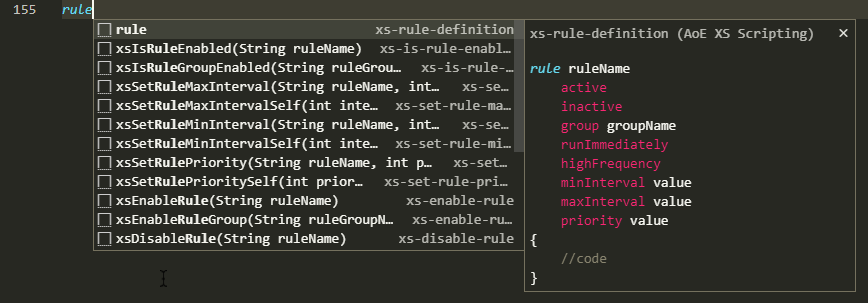

# AoE XS Scripting

## Features

This extension enables

1. Syntax highlighting for XS Scripts
2. Code tab completion for XS Scripts

XS Scripts are External Subroutines used by the games AoE2, AoE3 and AoM

## Example:

1. Syntax Highlighting:

    

2. Code tab completion

    

## Release Notes

### 1.0.0

Currently, only the functions and features of XS implemented by AoE2DE are supported in auto completion.